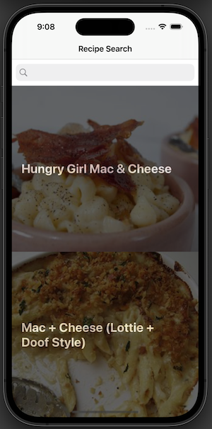
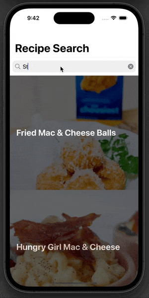

# Recipe Search 
This app uses this Edamam API. The user can search for a recipe, and 50 recipes are returned related to the search Query 

## Key Components
<ul>
  <li>Extension on UIImage</li>
  </ul>
  
``` Swift
extension UIImageView {
    
    // instance method, works on an instance of UIImageView
    
    func getImage(with urlString: String,
                  completion: @escaping (Result<UIImage, AppError>) ->()) {
        
        // configure UIActivityIndicatorView
        let activityIndicator = UIActivityIndicatorView(style: .large)
        activityIndicator.color = .systemGray2
        activityIndicator.center = center // center implies center of UIImageView
        addSubview(activityIndicator)
        // this line of code adds the UIActivityIndicatorView to the UIImageView
        activityIndicator.startAnimating()
        
        guard let url = URL(string: urlString) else {
            completion(.failure(.badURL(urlString)))
            return
        }
        
        let request = URLRequest(url: url)
        
        NetworkHelper.shared.performDataTask(with: request) { [weak activityIndicator] (result) in
            DispatchQueue.main.async {
                activityIndicator?.stopAnimating()
            }
            switch result {
            case .failure(let appError):
                completion(.failure(.networkClientError(appError)))
            case .success(let data):
                if let image = UIImage(data: data) {
                    completion(.success(image))
                }
            }
        }
    }
}
```
<ul>
<li> Network Helper, a singleton class used to make URLSession more accessible across the app </li>
</ul>

``` Swift

enum AppError: Error {
  case badURL(String)
  case noResponse
  case networkClientError(Error)
  case noData
  case decodingError(Error)
  case badStatusCode(Int)
  case badMimeType(String)
}

class NetworkHelper {

  static let shared = NetworkHelper()
  private var session: URLSession

  private init() {
    session = URLSession(configuration: .default)
  }
  
  func performDataTask(with request: URLRequest,
                       completion: @escaping (Result<Data, AppError>) -> ()) {

  
    let dataTask = session.dataTask(with: request) { (data, response, error) in

      if let error = error {
        completion(.failure(.networkClientError(error)))
      }

      guard let urlResponse = response as? HTTPURLResponse else {
        completion(.failure(.noResponse))
        return
      }

      guard let data = data else {
        completion(.failure(.noData))
        return
      }

      switch urlResponse.statusCode {
      case 200...299: break
      default:
        completion(.failure(.badStatusCode(urlResponse.statusCode)))
        return
      }

      completion(.success(data))
    }
    dataTask.resume()
    
  }
}
```
## Media

 
